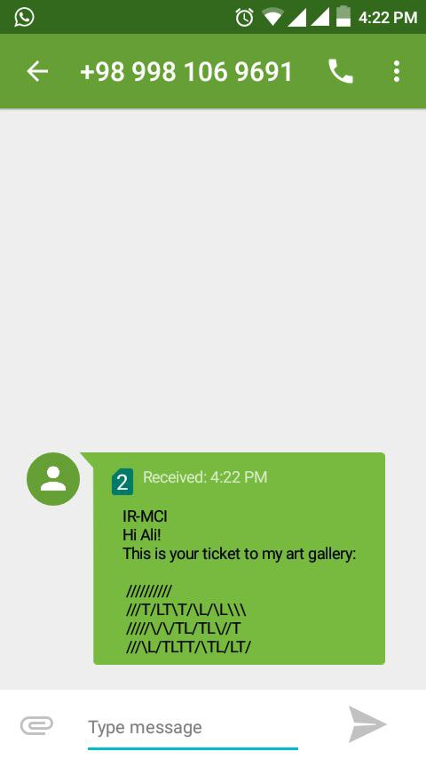

## Introduction

This solution is a simple ticket generation and scan application for small events. 

The ticket is encoded as a series of alphanumeric characters (symbols) to be sent to mobile devices (even legacy mobile phones) as short message text. 

The scanner (which is a PC with webcam for experiments, or an embedded device like a *Beaglebone Black* with a camera in action) can read the ticket from display of the mobile device when exposed.


## How Does it Work?

An event like an art galley is going to sell tickets. We assign a unique event ID to this event, say 17. Then we setup generator and scanner for the event (as described in [Build Instructions](#build-instructions)), put the `scanner` binary into the embedded computer (scanner device) and prepare for selling tickets. 

For each customer, ticket seller generates a new ticket by running the `generator` application. A ticket is like this: 

```
  //////////
  ///T/LT\T/\L/\L\\\
  /////\/\/TL/TL\//T
  ///\L/TLTT/\TL/LT/
```

Tikcet seller sends this ticket to mobile phone of the customer, through SMS. 



In the event day, the customer opens the ticket message on his phone, and exposes it to the scanner camera, which may be inside a entrance gate, or may be a handheld device (or smart phone) in the hands of the usher. 

Then the ticket is validated by the `scanner` application, and is registered as expired. 

## Requirements

a UNIX-based operating system with required library packages:

- libopencv-dev
- libboost-thread-dev
- libboost-system-dev
- libboost-chrono-dev
- libboost-filesystem-dev
- libgsl0-dev
- libsqlite3-dev


### Hardware Requirements

a camera/webcam attached to PC for image capture and process by alphacode ticket scanner (which is part of this application).


## <a name="build-instructions"></a>Build Instructions

The following instructions will build scanner and generator executables together.

```bash
autoreconf -iv
mkdir build
cd build
../configure --help
../configure --with-event-code=1 --with-symbol-size=5 --with-lines=3 --with-line-length=15 --with-checksum-length=9 --with-correlation=5
make
```

### Configuration Parameteters

- **Event Code** is the event ID, to distinguish ticket number (say) 12 of and art gallery from ticket number 12 of a amusement park. This is specified with `--with-event-code` argument of the confugure script.
- **Symbol Size** is size of the symbol set to use for generating tickets. See [Symbols](#symbols) for details. This is specified with `--with-symbol-size` argument of the confugure script.
- **Lines** determines count of lines of the generated ticket. This is specified with `--with-lines` argument of the confugure script.
- **Line Length** specifies width of each line. This is specified with `--with-line-length` argument of the confugure script.
- **Checksum Length** denotes count of characters in each line to be used as checksum redundancy. The bigger the value, the more strong the ticket will be against forgery.
- **Correlation** specifies correlation between lines of text, to make them inter-depdendent.

### <a name="symbols"></a>Symbols

Symbols used to generate ticket, are selected to be farthest apart and most distinguishable for the image processing algorithm used in the scanner applicaion. The set of symbols depend on the size of symbol set:

| Symbol Size | Symbols         |
|-------------|-----------------|
| 3           | / \ T           |
| 4           | / \ T L         |
| 5           | / \ T L F       |
| 6           | / \ T L F H     |
| 7           | / \ T L F H X   |
| 8           | / \ T L F H X + |

## Example Usages

### Generate a SMS Ticket

In terminal, be in root directory of the project and then type this to generate next ticket:

```bash
./generate

# ticket number 65102662188 is:
# 
#   //////////
#   ///T/LT\T/\L/\L\\\
#   /////\/\/TL/TL\//T
#   ///\L/TLTT/\TL/LT/
# 
```

To specfiy ticket number, use this:

```bash
./generator -n 12

# ticket number 12 is:
# 
#   //////////
#   ///\TLL//\T//T/T\\
#   ///\TLT/T\TL\L\\LT
#   ////\\//////\\LL/T
# 
```

This will generate a new ticket to be sent as a SMS to ticket buyer.

### The Alphacode Scanner

After build, do this to run the scanner. A webcam is required:

```
./scanner
```

This will run the scanner which scans live video to find and register tickets! Watch standard output for information.
